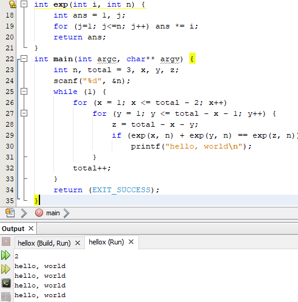
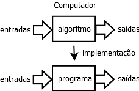
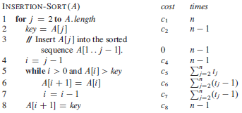

% Complexidade de Algoritmos
% Paulino Ng
% 2020-03-13

## Plano da aula

1. Ementa e bibliografia da disciplina
2. Por que estudar a complexidade de algoritmos?
3. Recapitulação: o que são algoritmos?
4. Como vamos apresentar os algoritmos?
5. Exemplos simples de análise de algoritmos

## Ementa

- Complexidade e desempenho.
- Análise da complexidade.
- Medidas de Complexidade.
- Comparação entre algoritmos recursivos e iterativos.
- Complexidade em algoritmos de busca e ordenação.
- Classes de problemas P, NP, NP-completo e NP- difícil.
- Estratégias para projetar algoritmos.
- Métodos de redução de problemas.

## Bibliografia

### Básica

[ZIVIANI] Nivio ZIVIANI, Projeto de Algoritmos: com implementações em Java e C++,
São Paulo: Cengage Learning, 2013.

[CLRS] Thomas H. Cormen, Charles E. Leiserson, Ronald L. Rivest & Clifford Stein,
Algoritmos: Teoria e Prática, 3&ordf; Ed., Rio de Janeiro: Elsevier, 2012.

### Apoio

[HMU] John E. Hopcroft, Rajeev Motwani & Jeffrey D. Ullman, Introduction to
Automata Theory, Languages, and Computation, 2nd Ed., Boston: Addison-Wesley, 2001.

[DPV] Sanjoy Dasgupta, Christos Papadimitriou & Umesh Vazirani, Algoritmos,
São Paulo: McGraw-Hill, 2009.

[CORMEN] Thomas H. Cormen, Desmitificando Algoritmos, Rio de Janeiro: Elsevier,
2013.

## Complexidade de um programa simples

- Por que estudar a complexidade de algoritmos?
- Nesta e nas próximas transparências, vamos usar o C no exemplo
- Seja o programa simples abaixo [HMU]:

```C
void main()
{
  printf("hello, world\n");
}
```
- O que ele faz?

## Modificado: Último teorema de Fermat: $x^n + y^n = z^n$
```C
int exp(int i, n) {
  int ans, j;  ans = 1;
  for (j=1; j<=n; j++) ans *= i;
  return(ans);
}
void main() {
  int n, total = 3, x, y, z;
  scanf("%d", &n);
  while (1) {
    for (x = 1; x <= total - 2; x++)
      for (y = 1; y <= total - x - 1; y++) {
        z = total - x - y;
        if (exp(x,n) + exp(y,n) == exp(z,n))
          printf("hello, world\n");
      }
    total++;
  }
}
```
<!--
-*
-->

## Questão

### O programa modificado vai imprimir "`hello, world`" como seus 12 primeiros caracteres?

## Resposta

* Para $n = 2$, ele vai imprimir diversas vezes `hello, world`
* Para $n > 2$, o programa entra em loop infinito sem imprimir nada
  - Os matemáticos levaram mais de 300 anos para concluir que o teorema de Fermat, $x^n + y^n = z^n$, para x, y, z, n naturais só tem solução para n = 2 estava certo.

  ### Como saber se um programa termina?

  > Esta é uma questão muito difícil de responder.

## Execução no NetBeans com cygwin32



## O que são algoritmos? [CLRS]

* Um **algoritmo** é um procedimento computacional bem definido que recebe um valor, ou um conjunto de valores, como **entrada** e produz algum valor, ou um conjunto de valores, como **saída**. Um algoritmo é uma sequência de passos computacionais que transformam a entrada na saída.



## Problema a ser resolvido

* Algoritmos servem para resolver *problemas computacionais*. Os problemas precisam ser *bem* definidos.
* Exemplo: Problema da ordenação de uma sequência de números

> **Entrada**: Uma sequência de n números $\{a_1, a_2, \ldots , a_n\}$.
> **Saída**: Uma permutação (reordenação) $\{a_1', a_2', \ldots , a_n'\}$ da sequência de entrada tal que $a_1' \leq a_2' \leq \ldots \leq a_n'\}$

## Apresentação dos Algoritmos

* Os algoritmos nesta disciplina serão apresentados em alguma linguagem de programação ou em pseudo-código
* Exemplo em linguagem, Java:

```java
public static int max(int v[], int n) {
  int max = v[0];
  for (int i = 1; i < n; i++) if (max < v[i]) max = v[i];
  return max;
}
```

## Pseudo-código (em português)

```
funcao fib1(n)
  se n == 0 retorna 0
  se n == 1 retorna 1
  retorna fib1(n - 1) + fib1(n - 2)
```

## Regras para o pseudo-código

* Vamos seguir as regras para pseudo-código do livro "Algorítmos" [CLRS]
  - as variáveis não são declaradas, nem obrigatoriamente inicializadas, elas são locais aos algoritmos/procedimentos. Não são usadas variáveis globais
  - identação \(tabulação\) para indicar bloco
  - as malhas de repetição \(loops\) usam `while`, `for` e `repeat` semelhante ao Pascal. O `for` é uma malha de repetição controlada por um contador cujo valor final, o de saída, pode ser usado depois da malha. Ele usa `to` se o contador incrementa e `downto` se o contador decrementa, além disso o passo é declarado, opcionalmente, com `by`.
  - comentários são introduzidos com `//`
  - atribuições múltiplas são válidas: `a = b = c = sin(3.14159/4)`
  - elementos dos *arrays* são acessados por colchetes, `A[1]`. Dois pontos são usados para indicar os índices de um *sub-array*, `A[2..5]`

##

  - os parâmetros são sempre passados por valor. Isto é, os argumentos não são modificados por atribuições feitas dentro do algoritmo. Mas se um objeto é passado e um método muda o objeto, o objeto original \(o argumento\) é modificado \(como no Java\). Um *array* é um objeto, o conteúdo do *array* pode ser modificado, mas o *array* não pode ser trocado por outro.
  - o `return` pode retornar nenhum valor, um valor ou vários valores \(como no Python\)
  - os operadores lógicos `and` e `or` são preguiçosos, isto é, assim que o resultado da operação é conhecido, os outros operandos não são calculados.
  - a palavra-chave `error` é usada para indicar erro no cálculo do procedimento, ela deve ser tratada por chamador do procedimento.

## O que significa analisar um algoritmo?

* Desejamos saber quantos recursos computacionais são necessários para um algoritmo resolver um problema com uma entrada de tamanho **n**.
* Existem diferentes recursos computacionais que um algoritmo necessita. Por exemplo:
  - tempo de processamento;
  - espaço memória;
  - operações de entrada/saída;
  - operações de leitura e escrita em disco;
  - comunicação em rede.
* Nesta disciplina estamos apenas interessados no tempo de execução.

## Análise de Algoritmos

* Knuth diz que na área de análise de algoritmos, existem 2 tipos de problemas bem distintos:
  1. Análise de um algoritmo especifico
  2. Análise de uma classe de algoritmos
* [CLRS] diz que precisamos de um modelo do computador que pretendemos usar. Modelos possíveis:
  - Máquina de Turing: modelo teórico, muito complexo para algoritmos mais complexos
  - Máquina MIX: programação quase *assembly*
  - Máquina de Acesso Aleatório (RAM): modelo não muito preciso quanto ao conjunto de instruções, apenas define que as instruções são executadas uma depois da outra, isto é, não existem operações concorrentes. A RAM contem as instruções típicas de um computador: aritméticas, movimentação de dados, controle de fluxo (condicionais, desvios, chamadas de rotinas, retornos). Cada instrução leva um tempo constante para executar. Os tipos de dados são inteiros e ponto flutuante.

## Análise de um algoritmo simples

Seja o algoritmo simples para encontrar o maior elemento de um vetor [ZIVIANI]

```java
public static int max(int v[], int n) {
  int max = v[0];
  for (int i = 1; i < n; i++) if (max < v[i]) max = v[i];
  return max;
}
```

* Este algoritmo precisa fazer `n - 1` comparações para determinar o  maior elemento do vetor
  - Não estamos considerando as instruções do for, é óbvio que elas são necessárias.
  - Ziviani demonstra que esta classe de problemas precisa de `n - 1` comparações para determinar o maior elemento de uma sequência de valores.

## Diferentes possibilidades

```Java
public static int[] maxMin1(int v[], int n) {
  int max = v[0], min = v[0];
  for (int i = 1; i < n; i++) {
    if (v[i] > max) max = v[i];
    else if (v[i]) < min) min = v[i];
  }
  int[] maxMin = new int[2];
  maxMin[0] = max; maxMin[1] = min;
  return maxMin;
}
```

Esta implementação do procedimento para achar o maior e o menor elemento  de um vetor tem *complexidade*:

> melhor caso: f(n) = n - 1 (vetor em ordem crescente)

> pior caso: f(n) = 2(n - 1) (vetor em ordem decrescente)

> caso médio: f(n) = (3n - 3)/2 (vetor não pré-ordenado)

## Insert sort (ordenação por inserção) com análise mais detalhada [CLRS]



$T(n) = c_1n + c_2(n-1) + c_4(n-1) +c_5\sum_{j=2}^nt_j + c_6\sum_{j=2}^n(t_j-1)+c_7\sum_{j=2}^n(t_j-1) + c_8(n-1)$

## Nível da Análise

* Enquanto Ziviani propõe analisar os programas para encontrar o mínimo e o máximo pela contagem do número de comparações, CLRS nos mostra como equacionar o tempo de execução de um algoritmo em RAM contando o tempo em cada instrução.
* A análise de complexidade de algoritmos, em geral, não precisa de tantos detalhes como no equacionamento de CLRS, até mesmo a análise realizada por Ziviani é muito detalhada o que se procura em geral.
* O que pretendemos entender é como o algoritmo se comporta para uma entrada com um **n** muito grande e como o tempo de execução cresce com o aumento de n *grande*.
* O *significado de n grande* depende muito do tipo de problema e do algoritmo.

## Exercício

Proponha um algoritmo para calcular o valor de um polinômio.

*Entradas*: $a_n, a_{n-1}, \ldots, a_1, a_0, x$

*Saída*: valor de $P(x) = a_n x^n + a_{n-1} x^{n-1} + \ldots + a_1 x + a_0$

* Analise a complexidade do seu algoritmo
* Se seu algoritmo não usava a técnica de Tataglia para calcular o valor do polinômio, veja quantas operações são necessárias para calcular o polinômio com o método de Tataglia:
$a_0 + x \cdot (a_1 + x \cdot (a_2 + x \cdot ( \ldots x \cdot (a_{n-1} + x \cdot a_n))))$
